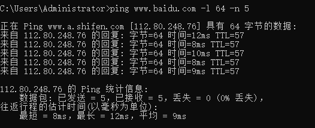
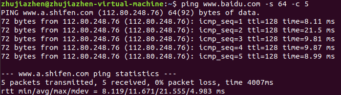
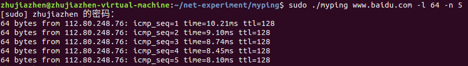

---
author:
title: PING程序的实现
---

# 实验内容

## 实验目的

理解ping程序的概念，熟练使用原始套接字

## 实验环境

Linux，C

## 实验内容

1.  设计一个简单的PING程序，每隔1秒钟使用ICMP报文向目的IP地址发一个ICMP请求（长度由length指定），对方将返回一个ICMP应答，应答数据包通过循环调用函数recvfrom来接收。发送ICMP报文的次数由counts指定

2.  ping dstIP --l length --n counts

# 实验设计

## ping程序执行

首先我们执行ping程序，了解我们要做的输出是什么样的，执行出来的效果如下：

<figure id="sw">
<p> <span
id="sw" label="sw"></span></p>
<figcaption>windows终端执行结果</figcaption>
</figure>

<figure id="li">
<p> <span
id="li" label="li"></span></p>
<figcaption>Linux终端执行结果</figcaption>
</figure>

我们接下来就根据Linux的输出结果进行一个复现。

## 程序分块

根据题意，我们可以将代码分为几个重要部分：计算校验和、发送ICMP请求
以及接受ICMP请求。各个函数的具体实现在下一部分讲解。

# 关键程序

## 计算校验和

::: flushleft
``` {.objectivec language="C"}
unsigned short calcChecksum(unsigned short *addr, int len)
{
    unsigned int sum = 0;
    unsigned short answer = 0;
    unsigned short *w = addr;
    int nleft = len;

    while (nleft > 1) {
        sum += *w++;
        nleft -= 2;
    }

    if (nleft == 1) {
        *(unsigned char *)(&answer) = *(unsigned char *)w;
        sum += answer;
    }

    sum = (sum >> 16) + (sum & 0xFFFF);
    sum += (sum >> 16);
    answer = ~sum;
    return answer;
}
```
:::

校验和是为了确保数据在传输过程中的完整性。接收方可以通过校验和验证数据是否被篡改或损坏。

'calcChecksum'函数使用了标准的互联网校验和算法，对每个16位的字进行求和，并进行溢出的处理。
同时，计算校验和时使用无符号短整型（unsigned
short）是为了确保计算的结果符合互联网校验和算法的规范。
如果使用有符号短整型（short），可能会导致计算结果出现溢出或不符合预期，因为有符号短整型的范围是从负数到正数，而不是从0到正数。

## 发送ICMP请求

``` {.objectivec language="C"}
int sendPingRequest(int sockfd, struct sockaddr_in *dest_addr, int packet_size, int seq)
{
    struct icmp *icmp_packet;
    char send_packet[PACKET_SIZE];
    int packet_len;

    icmp_packet = (struct icmp *)send_packet;
    icmp_packet->icmp_type = ICMP_ECHO;
    icmp_packet->icmp_code = 0; // 询问报文  
    icmp_packet->icmp_id = getpid();
    icmp_packet->icmp_seq = seq;
    memset(icmp_packet->icmp_data, 0xa5, packet_size);
    gettimeofday((struct timeval *)icmp_packet->icmp_data, NULL);

    packet_len = 8 + packet_size;
    icmp_packet->icmp_cksum = 0;
    icmp_packet->icmp_cksum = calcChecksum((unsigned short *)icmp_packet, packet_len);

    if (sendto(sockfd, send_packet, packet_len, 0, 
        (struct sockaddr *)dest_addr, sizeof(struct sockaddr)) == -1) {
        perror("sendto error");
        return -1;
    }

    return 0;
}        
```

发送函数中，我们使用了icmp结构体：

``` {.objectivec language="C"}
struct icmphdr {
    uint8_t type;        // ICMP 报文类型
    uint8_t code;        // ICMP 报文代码
    uint16_t checksum;   // ICMP 报文校验和
    // 其他字段根据不同的 ICMP 报文类型可以有不同的定义
};
```

数据部分被填充为0xa5，并使用'memset'函数将数据部分的字节设置为指定的值。这是为了在发送方和接收方之间提供一致的数据，以便检查传输的正确性。

## 接收ICMP请求

``` {.objectivec language="C"}
int receivePingResponse(int sockfd, int seq)
{
    char recv_packet[PACKET_SIZE];
    struct sockaddr_in from;
    socklen_t from_len;
    int packet_len;

    while (1) {
        memset(recv_packet, 0, sizeof(recv_packet));
        from_len = sizeof(from);

        if ((packet_len = recvfrom(sockfd, recv_packet, sizeof(recv_packet), 0, 
                    (struct sockaddr *)&from, &from_len)) == -1) {
            perror("recvfrom error");
            return -1;
        }
        // printf("Received ICMP response from: %s\n", inet_ntoa(from.sin_addr));

        // 解析ICMP应答
        struct ip *ip_packet = (struct ip *)recv_packet;
        struct icmp *icmp_packet = (struct icmp *)(recv_packet + (ip_packet->ip_hl << 2));

        if (icmp_packet->icmp_type == ICMP_ECHOREPLY && icmp_packet->icmp_id == getpid()
            && icmp_packet->icmp_seq == seq) {
        struct timeval *st = (struct timeval *)icmp_packet->icmp_data;
        struct timeval ct;
        gettimeofday(&ct, NULL);

        double rtt = (ct.tv_sec - st->tv_sec) * 1000.0 + (ct.tv_usec - st->tv_usec) / 1000.0;
            printf("%d bytes from %s: icmp_seq=%d time=%.2fms ttl=%d\n",
               packet_len, inet_ntoa(from.sin_addr), seq, rtt, ip_packet->ip_ttl);
        // printf("ICMP response received.\n");
            break;
        }
    }

    return 0;
}
```

在接受icmp函数中， 首先，根据IP首部的长度字段找到ICMP首部的位置。
然后，检查ICMP类型是否为ICMP回显应答，并验证ICMP标识和序列
号与发送的请求是否匹配。最后，计算往返时间（RTT）并输出相关 信息。

## 主函数

在主函数解析地址时，'inet_pton'函数用于将点分十进制表示的IPv4地址转换为二进制形式。而'gethostbyname'函数用于解析主机名，将主机名转换为IP地址。

# 实验结果与分析

最后，myping的运行结果如下：

<figure id="rw">
<p> <span
id="rw" label="rw"></span></p>
<figcaption>myping终端执行结果</figcaption>
</figure>

可以看出结果较为清晰，比较真实的还原了Linux上ping的输出结果。
